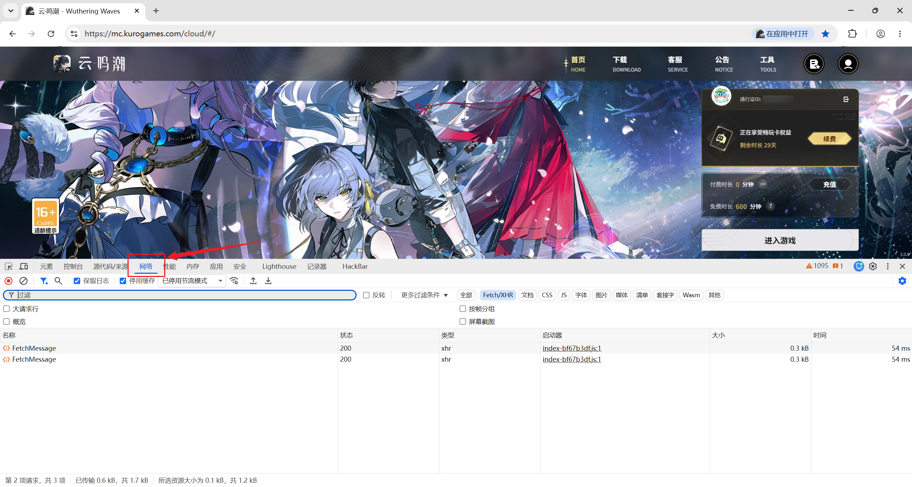
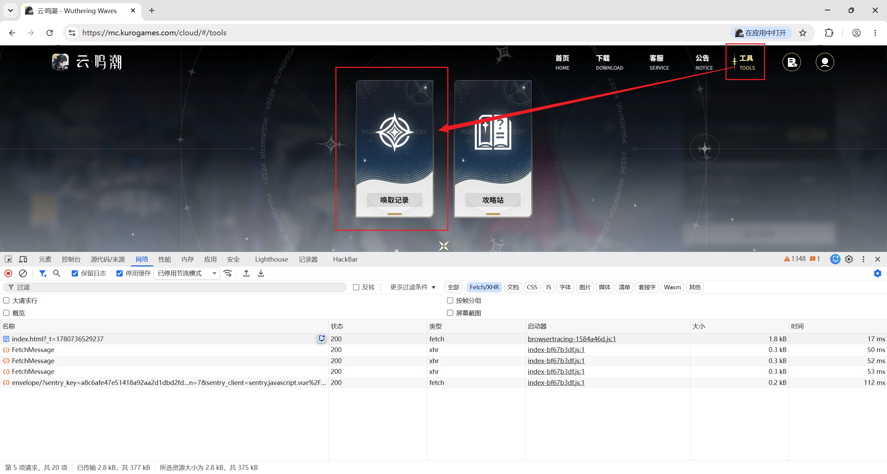
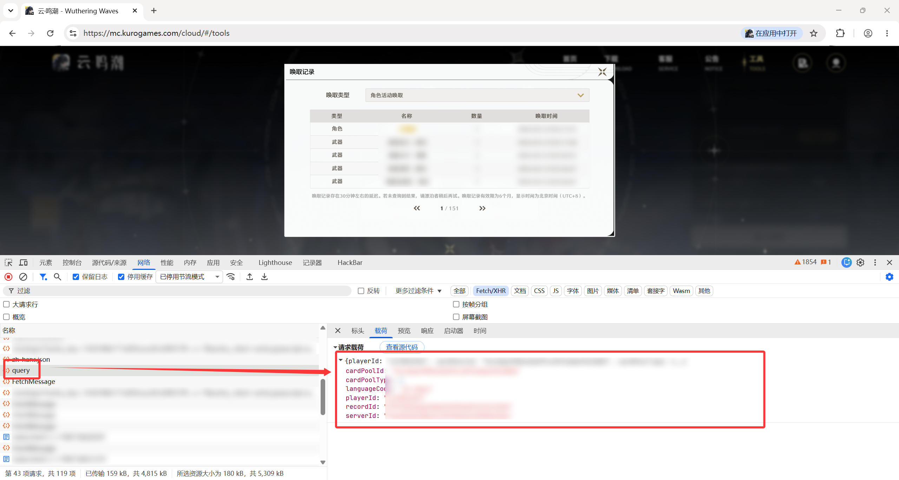
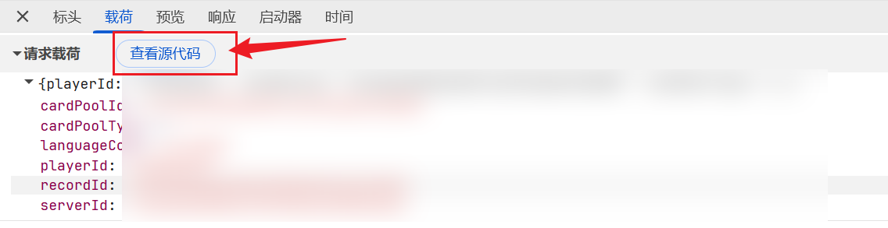
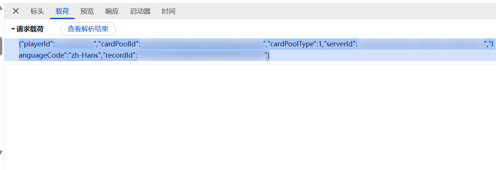
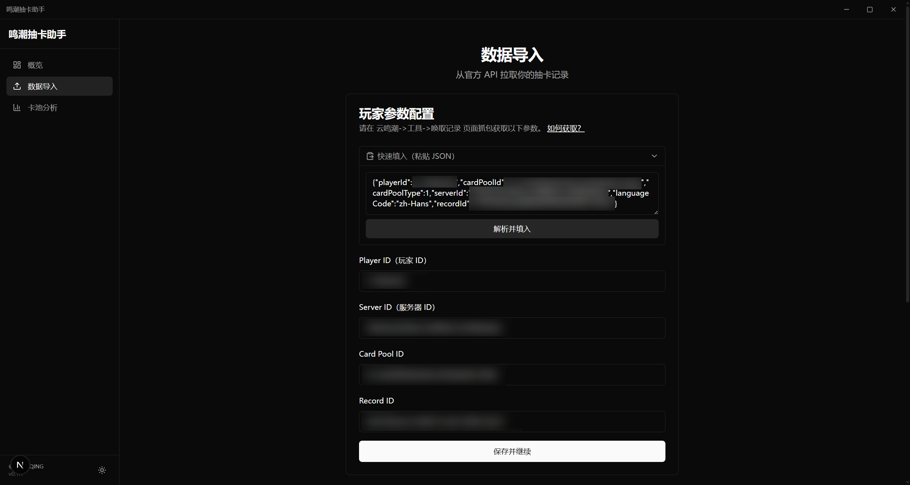

# 通过云鸣潮获取请求参数

应用需要四个参数（playerId、serverId、cardPoolId、recordId），可通过浏览器开发者工具从云鸣潮页面抓包获取。

以 Google Chrome 浏览器为例，下面是具体步骤。

---

### 1. 打开云鸣潮

登录 [云鸣潮](https://mc.kurogames.com/cloud/#/)。

### 2. 打开开发者工具

按 `F12` 打开浏览器开发者工具，切换到 **网络**（Network）面板。

### 3. 进入唤取记录页面

在云鸣潮中依次点击 **工具 → 唤取记录**。

### 4. 找到 query 请求

在网络请求列表中，找到名为 `query` 的请求，点击查看详情。

### 5. 复制参数到应用

有两种方式，推荐使用快速填入：

**方式一：快速填入（推荐）**

在 query 请求详情中，切换到 **载荷**（Payload）标签，点击 **查看源代码**，全选复制原始 JSON，粘贴到应用的「快速填入」框中即可自动解析。

**方式二：手动填入**

将载荷中各字段逐一复制到应用对应的输入框。
